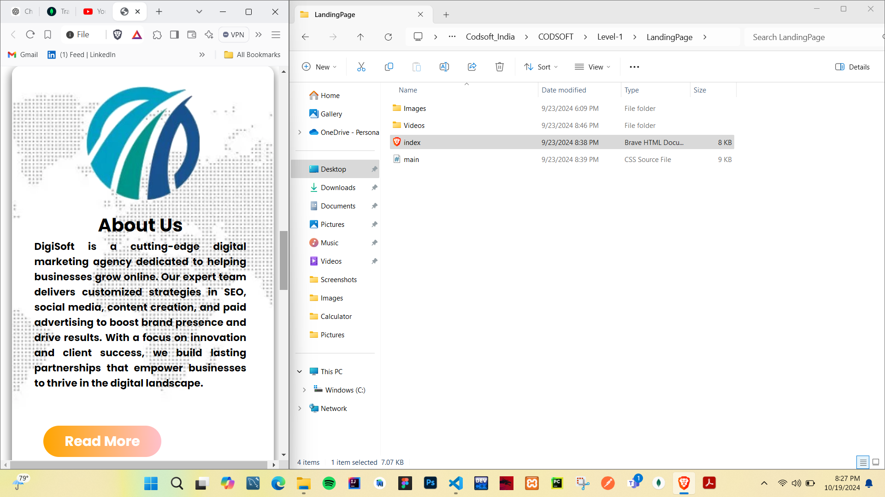
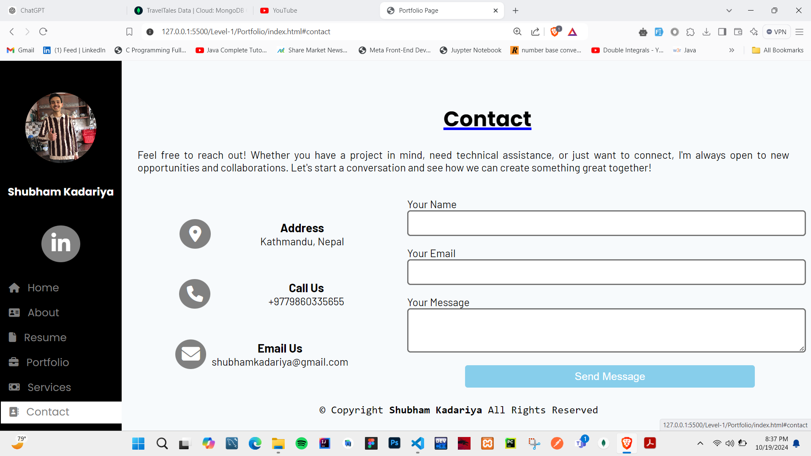
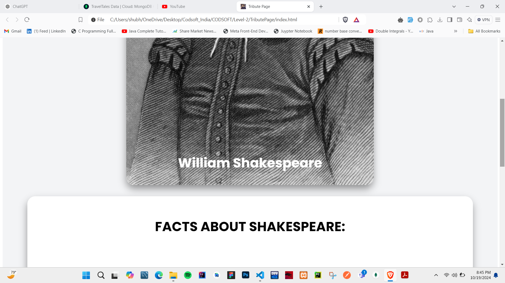

# CODSOFT

Codsoft Indian Internship!

# Important Notes:

1. For Every Completed Project There Will Be A Folder Specified as Videos, inside of which there will be a demo.mkv file which is a screen-recording of the project working on my device.

2. I will include the screenshot of the project is applicable!

3. Every Project Completed Will Be Tried To Be described Here.

# Level - 1 : [Calculator]

# Calculator Application

This is a simple and user-friendly calculator application developed during my internship at **Codsoft**. The application performs basic arithmetic operations such as addition, subtraction, multiplication, and division.

## Features

- **Basic Operations**: Perform addition, subtraction, multiplication, and division.
- **User-Friendly Interface**: Easy-to-use interface for seamless user experience.
- **Responsive Design**: Compatible with both desktop and mobile devices.

## Technologies Used

- **Frontend**: HTML, CSS, JavaScript

## ScreenShots

- 
- 
- 
- 

# Level - 1 : [Landing Page For Digisoft]

# Digisoft Landing Page

Welcome to the **Digisoft Landing Page**! This project showcases the services and offerings of Digisoft, an Indian digital marketing company. The landing page is designed to attract potential clients and provide them with information about digital marketing solutions.

## Features

- **Responsive Design**: Fully responsive layout for seamless viewing on desktop and mobile devices.
- **Service Sections**: Detailed descriptions of various digital marketing services offered by Digisoft.
- **Engaging UI**: A visually appealing interface with smooth animations and user experience.

## Technologies Used

- **Frontend**: HTML, CSS, JavaScript

## Screenshots

- 
- 
- 
- 
- 
- 
- 
- 
- 
- 
- 

# Level - 1 : [Portfolio]

# Portfolio

Welcome to my **Portfolio**! This project showcases my work, skills, and experiences as a developer. Here, you will find information about my projects, technologies I use, and my journey in the field of software development.

## Features

- **Project Showcase**: A collection of my personal and professional projects with descriptions and links to live demos and source code.
- **Skills Section**: An overview of the programming languages, frameworks, and tools I am proficient in.
- **Contact Information**: A dedicated section for potential employers and collaborators to get in touch with me.

## Technologies Used

- **Frontend**: HTML, CSS, JavaScript

## ScreenShots

- 
- 
- 
- 
- 
- 

# Level - 2 : [Contribution Page] Willaim Shakespare

# William Shakespeare Contribution Page

Welcome to the **William Shakespeare Contribution Page**! This project provides an overview of the life, works, and contributions of William Shakespeare, one of the most renowned playwrights and poets in history. The page is designed using HTML and CSS.

## Features

- **Biographical Information**: A brief biography of William Shakespeare, highlighting key milestones in his life.
- **Notable Works**: A list of Shakespeare's most famous plays and poems.
- **Contributions**: Insights into Shakespeare's impact on literature and the English language.
- **Styling**: Custom CSS styles for an aesthetically pleasing layout.

## Technologies Used

- **HTML**: For the structure of the page.
- **CSS**: For styling the page.
- **No JavaScript**: This project does not include JavaScript functionalities.

## ScreenShots

- 
- 
- 
- 
- 

# Level - 3 : [Blog-Application] Travel Tales

Welcome to **Travel Tales**! This platform allows users to share their travel experiences, connect with fellow explorers, and discover new destinations through captivating stories.

## Features

- **User Registration**: Users can create an account to start sharing their travel tales.
- **Post Travel Stories**: Users can publish their own travel stories and adventures.
- **Edit and Delete Posts**: Manage your content easily with editing and deletion options.
- **Responsive Design**: Access the platform seamlessly on both desktop and mobile devices.

## Technologies Used

- **Frontend**: React, Tailwind CSS
- **Backend**: Node.js, Express
- **Database**: MongoDB
- **Email Service**: Nodemailer (for sending emails)
- **Deployment**: Vercel

## Implement The Project

- Set up environment variables: Create a .env file in the root directory and add your configuration:
  gmail_Mail=your_email@gmail.com
  gmail_Password=your_password

Acknowledgments
Nodemailer - For handling email notifications.
Tailwind CSS - For styling the application.
MongoDB - For database management.
Special thanks to all contributors and the community for their support!
Unsplash.com - For Images Being Used.
Contributing
Contributions are welcome! Please feel free to submit a pull request or open an issue for any enhancements or bug fixes.
